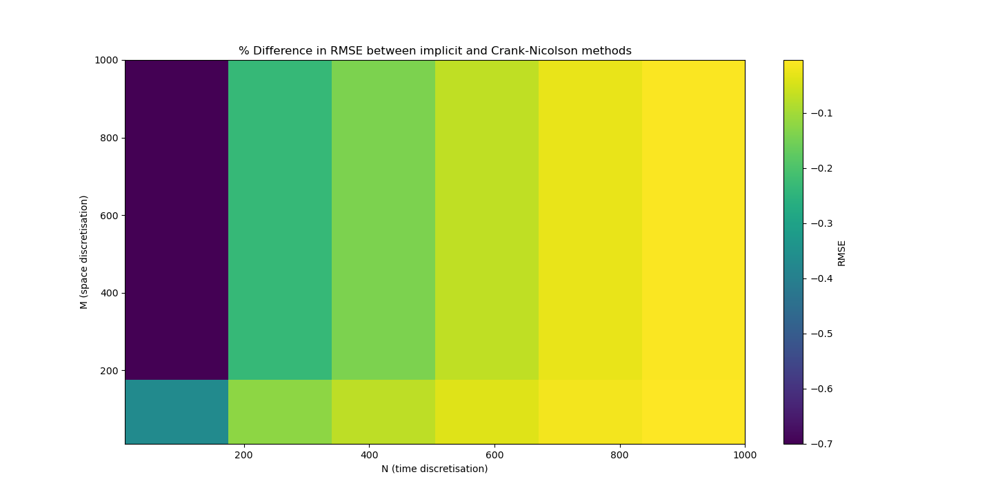

# Table of Contents

1.  [Partial Differential Equation Solver](#org62e5b51)
2.  [Features](#org791b0d9)
    1.  [Thomas Algorithm](#orgd0cbe60)
    2.  [Implicit Scheme Solution](#orgfc61099)
    3.  [Crank Nicolson Scheme](#org6b057c1)
    4.  [Benchmarking and Comparisons](#orgcd8ef55)
3.  [Optimisations](#org02b30a7)
    1.  [Algorithms](#orgeb5da0a)
4.  [Project Insights](#org9f35a6a)
5.  [Potential Improvements](#org7dbe565)
6.  [References](#orge0875d2)

# Partial Differential Equation Solver

This project implements three schemes for solving Partial Differential Equations (PDEs), directed at the Black-Scholes PDE:

$$
\frac{\partial V}{\partial t} + \frac{1}{2} \sigma^2 S^2 \frac{\partial^2 V}{\partial S^2} + r S \frac{\partial V}{\partial S} - rV = 0,
$$

with boundary conditions:

$$
\underset{s \rightarrow 0}{\lim} V(s,t) = r_t (t), \forall t \in [0,T]
$$

$$
\underset{s \rightarrow \infty}{\lim} \frac{V(s,t)}{r_2 (s,t)} = 1, \forall t \in [0,T]
$$

$$
V(s,T) = \max(0, S_T - K) 
$$

Where $V$ is the value of the option, $t$ is the time variable, $\sigma$ is the volatility, $S$ is the price of the underlying asset, $r$ is the interest rate, and $K$ is the strike price. Typically, we have a left boundary equal to 0, and a right boundary equal to the stock price minus the strike. Equation and approximations are from Chapter 21 of (<a href="#citeproc_bib_item_1">Hull, 2022</a>). A [full report](Report.pdf) is available for insights and documentation. All code is available in the [project file](Main.py).

This project includes:

-   A custom implementation of the Thomas Algorithm for solving tridiagonal linear systems of equations,
-   An implicit Finite Difference method solver,
-   A Crank-Nicolson Finite Difference solver,
-   Benchmarking for all three functions,
-   Detailed error analysis for the differencing schemes,
-   Highly optimised code making best use of numpy and numba.

# Features

## Thomas Algorithm

Structurally, the differencing schemes used in this project provide tridiagonal systems of equations for each discretised time step. In order to efficiently solve this, I implement the Thomas Algorithm. This has $\mathcal{O} (N)$ time complexity and only requires 4 vectors of length $N$ in memory to solve. This is benchmarked against the scipy banded equation solver, and demonstrates higher memory efficiency across a range of test cases.

## Implicit Scheme Solution

The implicit scheme uses a backwards loop to approximate PDEs. It is:

-   Unconditionally stable,
-   Robust against course discretisation in the state space,
-   Highly performant, and fully implemented using numpy calculations and numba pre-compiled loops.

## Crank Nicolson Scheme

The Crank-Nicolson Scheme uses a central differenced approximation to achieve better convergence. It is:

-   Accurate to the second order in space and time,
-   Combines explicit and implicit solutions,
-   Has theoretically lower root mean squared error (RMSE) than both methods.

## Benchmarking and Comparisons

Benchmarking was conducted on all three functions, with all three demonstrating extremely high runtime efficiency over a range of test cases. I was able to reproduce the time discretisation efficiency / stability gain from the Crank-Nicolson over the implicit scheme.

# Optimisations

## Algorithms

A variety of algorithmic choices were made to increase speed.

-   The Thomas Algorithm allows for a highly efficient way to solve the systems of equations generated by the approximation schemes,
-   Numpy and numba allow for functions to be precompiled for maximal runtime efficiency,
-   Robustness tests with unit testing and function guards allow for inputs to be safe and errors to be checked within Python rather than numba.

# Project Insights

-   I was able to reproduce the theoretical efficiency gains from the Crank-Nicolson over the implicit scheme,
-   numba workflows are fast, but can be extremely brittle, and have poor error messages by default, careful function design is necessary to make serious projects,
-   numpy supports fast vector mathematics, numba enables faster dynamic programming loops.

# Potential Improvements

-   Pricing American options?
-   Using my derivation of the Black-Scholes with dividends,
-   other exotic options?

# References

  
Hull, J. 2022. <i>Options, Futures, and other Derivatives</i> 11th ed. Harlow: Pearson.

